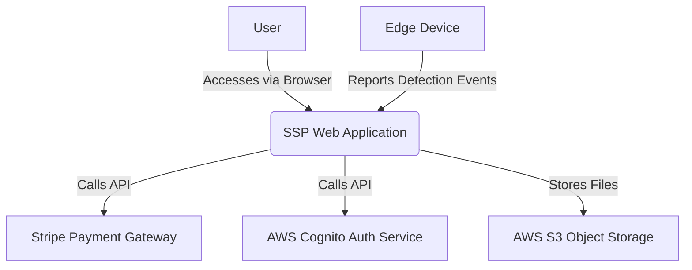

# SSP (Smart Store Payment) - Technical Design Document (TDD)

**Version**: 1.0  
**Date**: 2025-11-17

---

## 1. System Architecture

### 1.1. High-Level Architecture (C4 Model - Level 1)

The SSP system utilizes a Monorepo architecture with a decoupled frontend and backend, hosted entirely on a cloud platform (AWS). The system consists of four core components: the User, the SSP Web Application, Third-Party Services, and Edge Devices.



### 1.2. Container Architecture (C4 Model - Level 2)

The SSP Web Application itself is composed of a frontend React application (Client) and a backend Node.js application (Server). They share the same code repository but are independent processes during build and deployment. Data is stored in a MySQL database.

| Container | Description | Key Technologies |
| :--- | :--- | :--- |
| **Frontend App (Client)** | A React Single-Page Application (SPA) built with Vite, responsible for rendering all user interfaces and interactions. | React 19, Vite, TailwindCSS, tRPC Client |
| **Backend App (Server)** | A Node.js server based on Express.js and tRPC, responsible for handling all business logic and API requests. | Express.js, tRPC, Drizzle ORM, Node.js 22 |
| **Database** | A MySQL 8.0 database used for the persistent storage of all business data. | MySQL, Drizzle ORM |

### 1.3. Technology Choices and Rationale

| Domain | Technology Choice | Rationale |
| :--- | :--- | :--- |
| **Frontend Framework** | React 19 | It has a vast ecosystem and community support. New features in React 19 (like Actions) can simplify form and data mutation handling. |
| **Backend Framework** | Express.js + tRPC | Express.js is mature and stable. tRPC provides end-to-end type safety, significantly improving development efficiency and code robustness, and avoiding the tedious work of writing API documentation and client-side code. |
| **Database ORM** | Drizzle ORM | Lightweight and high-performance, it provides a type-safe SQL query builder with a syntax close to native SQL, resulting in a low learning curve and excellent integration with tRPC. |
| **Authentication** | AWS Cognito + JWT | Cognito offers a stable, secure, and scalable user pool and identity federation, meeting OAuth 2.0 requirements. JWT is used as the session mechanism for stateless authentication. |
| **UI Library** | TailwindCSS + shadcn/ui | TailwindCSS provides atomic CSS classes for highly customizable and rapid UI development. shadcn/ui offers a set of well-designed, accessible base components that can be copied directly into the project for modification. |

---

## 2. Data Model Design

The database uses MySQL 8.0, and the ORM is Drizzle ORM. The schema definition file is located at `drizzle/schema.ts`.

### 2.1. Entity-Relationship Diagram (ERD)

An ERD showing the relationships between the core tables should be included here.

### 2.2. Core Table Structures

| Table | Description |
| :--- | :--- |
| **users** | Stores all platform users, including consumers, merchants, and administrators.<br>- `openId` (varchar): The unique user ID returned by the authentication provider (e.g., Cognito), serving as a key external association ID.<br>- `role` (enum): User role (`user`, `merchant`, `admin`), used for implementing Role-Based Access Control (RBAC). |
| **merchants** | Stores merchant information.<br>- `userId` (int): Foreign key linked to the `id` in the `users` table, indicating the user account corresponding to the merchant. |
| **products** | Stores product information.<br>- `merchantId` (int): Foreign key linked to the `id` in the `merchants` table.<br>- `price` (int): Stored in cents to avoid floating-point calculation errors. |
| **orders & orderItems** | The `orders` table stores summary information for orders, while the `orderItems` table stores the specific items in an order, forming a one-to-many relationship. |
| **transactions** | Stores all payment transaction records.<br>- `orderId` (int): Linked to the `orders` table.<br>- `gateway` (varchar): The payment gateway, e.g., `stripe`.<br>- `gatewayTransactionId` (varchar): The transaction ID returned by the payment gateway. |
| **detectionEvents** | Stores raw event data from edge devices.<br>- `eventType` (enum): `PICK_UP` or `PUT_BACK`.<br>- `productId` (int): The ID of the recognized product.<br>- `confidence` (float): The confidence score of the recognition. |

---

## 3. API Design

The backend API is built with tRPC, providing end-to-end type safety without the need for traditional RESTful API documentation. All route definitions are located in `server/routers.ts` and combined into the `appRouter`.

### 3.1. Router Structure

-   **adminRouter**: Operations related to administrators.
-   **faceRecognitionRouter**: Facial recognition enrollment and verification.
-   **walletRouter**: Wallet operations.
-   **paymentMethodRouter**: Payment method management.
-   **realtimeOrderRouter**: Handles real-time order events from edge devices.
-   **stripeRouters**: Handles Stripe payments and webhooks.

### 3.2. Core tRPC Procedure Example

**Create Order (Example)**

```typescript
// server/realtimeOrderRouters.ts
export const realtimeOrderRouter = router({
  createOrderFromDetections: protectedProcedure
    .input(z.object({ 
      deviceId: z.string(),
      detections: z.array(z.object({ productId: z.number(), quantity: z.number() })),
    }))
    .mutation(async ({ ctx, input }) => {
      // 1. Validate if the deviceId is valid
      // 2. Query for prices based on product IDs
      // 3. Calculate the total order amount
      // 4. Create order and orderItems records in the database
      // 5. Return the newly created orderId
      // ... implementation omitted
    }),
});
```

### 3.3. Authentication and Authorization

-   **Authentication**: Implemented by passing a JWT in the request's Cookie. A backend middleware verifies the JWT's validity and injects user information into the tRPC context (`ctx`).
-   **Authorization**: tRPC provides `protectedProcedure`, a custom procedure that can only be called if a valid user exists in the `ctx`. Finer-grained permission control (e.g., for `admin` or `merchant` roles) is achieved by checking `ctx.user.role` within the procedure.

---

## 4. Frontend Architecture

### 4.1. Directory Structure

-   `client/src/pages`: Contains page-level components, with each file corresponding to a route.
-   `client/src/components`: Contains reusable UI components.
-   `client/src/hooks`: Contains custom React Hooks, such as `useAuth`.
-   `client/src/lib`: Contains utility functions and the tRPC client instance.

### 4.2. State Management

-   **Server State**: Managed using TanStack Query (`@tanstack/react-query`) for all data interacting with the backend API. It provides powerful features like caching, background refetching, and optimistic updates.
-   **Client State**: For simple, local UI state, React’s built-in `useState` and `useReducer` are used. For global client state that needs to be shared across components, Zustand or React Context is used.

### 4.3. Routing

-   The Wouter library is used for routing. It is a lightweight, hook-based routing solution well-suited for React.

---

## 5. Roadmap (Technical Perspective)

### 5.1. V1.1: Enhancing Core Experience and Security

| Module | Optimization | Technical Implementation | Priority |
| :--- | :--- | :--- | :--- |
| **User Auth** | Social Login | Configure Google, Facebook, etc., as identity providers in the AWS Cognito console. The frontend uses the Cognito Hosted UI or Amplify UI library to trigger the login flow. The backend handles user info in the callback and creates a local account. | High |
| **Security** | Multi-Factor Auth (MFA) | Enable MFA (TOTP) in the Cognito user pool. The frontend guides users to scan a QR code on the security settings page to bind their device. The backend adds a step to verify the MFA code during the login process. | High |
| **Real-time** | WebSocket Push | Create a WebSocket service on the Express server using the `ws` library or Socket.IO. The frontend establishes a persistent connection on pages like the Dashboard. When a significant event occurs (e.g., payment success), the backend pushes a message to the specific client via WebSocket. | Medium |

### 5.2. V1.2: Feature Enrichment and Intelligence

| Module | Optimization | Technical Implementation | Priority |
| :--- | :--- | :--- | :--- |
| **Data Analysis** | Advanced Analytics | Introduce a dedicated data processing pipeline. For example, use AWS Lambda to periodically process the `orders` and `orderItems` tables, storing the analysis results (e.g., user profile tags, product association rules) in a new `analytics` table or a data warehouse like Redshift. | High |
| **Risk Control** | Anomaly Detection | Create a rule engine (can be a simple JSON config or a dedicated library). Use a message queue (like AWS SQS) to process transaction events asynchronously. The rule engine consumes queue messages and makes judgments. When an anomaly is detected, send an alert via AWS SNS. | High |
| **Performance** | DB Read/Write Splitting | Configure MySQL master-slave replication. Create two Drizzle ORM client instances: one for write operations (connecting to the master) and one for read operations (connecting to the slave). Route all query (SELECT) requests to the slave to reduce the load on the master. | Medium |

### 5.3. V2.0: Platform Ecosystem and Expansion

| Module | Optimization | Technical Implementation | Priority |
| :--- | :--- | :--- | :--- |
| **Architecture** | Microservices | Decompose loosely coupled modules (like Analytics, Face Recognition) into independent microservices. Each service has its own database and API. Communication between services can use tRPC or gRPC. Use an API gateway to unify the external entry point. | High |
| **Globalization** | i18n Support | Use the `react-i18next` library on the frontend. Extract all text strings into JSON files, organized by language. Load the appropriate language file based on the user's browser settings or personal preferences. | Medium |
| **CI/CD** | Automated Pipeline | Use GitHub Actions. Create a workflow that automatically runs tests, builds a Docker image, pushes it to an image repository (like AWS ECR), and triggers the server (e.g., ECS or EC2) to pull the new image and restart the service when code is pushed to the `main` branch. | High |

---

## 6. Deployment and Operations

-   **Deployment Unit**: After being built, the frontend and backend applications can be packaged into a single Docker image for deployment.
-   **Infrastructure as Code (IaC)**: It is recommended to use Terraform or AWS CDK to manage all cloud resources (EC2, S3, Cognito, RDS, etc.), enabling version control and repeatable deployments for the infrastructure.
-   **Logging and Monitoring**:
    -   **Logging**: Use a library like Winston to structure application logs in JSON format and send them to AWS CloudWatch Logs via the CloudWatch Agent for centralized management and querying.
    -   **Monitoring**: Use Prometheus + Grafana or AWS CloudWatch Dashboards to monitor key performance indicators (CPU/memory usage, API latency, error rates).
